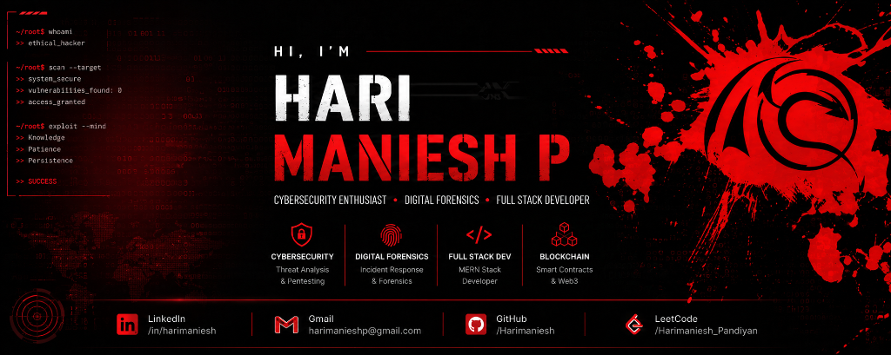

<div align="center">
  
</div>

<div align="center">
  
</div>

<br />

<div align="center">
  <a href="https://github.com/Harimaniesh">
    
  </a>
  <a href="https://www.linkedin.com/in/harimaniesh/">
    
  </a>
  <a href="mailto:harimanieshp@gmail.com">
    
  </a>
  <a href="https://leetcode.com/HariManiesh_Pandiyan/">
    
  </a>
  
</div>

---

## 👨‍💻 About Me

Final-year **Computer Science & Engineering** student at SNS College of Engineering, specializing in **IoT, Cybersecurity, and Blockchain Technology**. Passionate about threat analysis, digital forensics, secure application engineering, and building resilient systems that stand against evolving cyber threats.

```python
class HariManiesh:
    def __init__(self):
        self.name = "Hari Maniesh P"
        self.education = "B.E. Computer Science & Engineering (IoT, Cybersecurity & Blockchain)"
        self.institution = "SNS College of Engineering, Coimbatore, India"
        self.domains = [
            "Cybersecurity",
            "Digital Forensics",
            "Full Stack Development",
            "Blockchain",
            "DSA"
        ]
        self.mindset = "Learn → Build → Break → Secure"
        self.mission = "Build technology that deserves trust."
```

---

## 🎯 Current Focus

<div align="center">

```text
🛡️ Cybersecurity & Threat Analysis
           ↓
🔎 Digital Forensics & Incident Response
           ↓
🌐 Secure Full Stack Development
           ↓
⛓️ Blockchain & Web3 Systems
           ↓
🤖 AI Security & Intelligent Defense
```

</div>

---

## 🛡️ Cybersecurity Arsenal

```text
+-----------------------------------------------------------------------------------+
|  Forensics & Threat Analysis | Autopsy | FTK Imager | OSINT | Log & Malware       |
|  Network & Pentesting        | Kali Linux | Nmap | Wireshark | Metasploit         |
|  Security Engineering        | Network Security | Firewalls | Incident Response   |
+-----------------------------------------------------------------------------------+
```

<br />

<div align="center">
  
  
  
  
  
  
  <br />
  
  
  
  
  
  
</div>

---

## 💻 Development Stack

### Languages
<div align="left">
  
  
  
  
  
  
  
</div>

### Full Stack & Databases
<div align="left">
  
  
  
  
  
  
</div>

### Blockchain & Web3
<div align="left">
  
  
</div>

### Tools & Platforms
<div align="left">
  
  
  
  
</div>

<br />

<div align="center">
  
</div>

---

## 💼 Professional Experience

### 🛡️ Cybersecurity & Digital Forensics Specialist
**Boredmonk Cyber Security | Acmegrade Wipro Technology | InTrainz Innovation**
*June 2025 • April 2025 • November 2025*
* Mastered digital evidence acquisition techniques using **FTK Imager** and **Autopsy**.
* Conducted data recovery, log analysis, malware analysis, OSINT research, and dark web investigation protocols.
* Applied incident response techniques and enterprise network security practices (firewall management, threat detection, routing protocols).

### 🧪 Software Testing Intern
**Xortican (Freelancers' League)** — *Coimbatore, India*
*August 2024*
* Executed manual and automated testing across multi-platform web applications.
* Applied industry-standard QA methodologies, defect tracking, and performance testing frameworks to improve application stability.

### 🎨 UI/UX Design & Data Analytics Specialist
**Maiyyam**
*December 2024 – January 2025*
* Designed mobile and e-commerce UI/UX prototypes in **Figma** using human-centered design thinking principles.
* Developed interactive **Tableau** dashboards for enterprise business intelligence and data visualization analysis.

---

## 📜 Certifications

<div align="left">

| Icon | Certification | Issuer / Platform | Year |
| :---: | :--- | :--- | :---: |
| 🛡️ | **CompTIA Security+ Course** | Udemy | 2025 |
| 🤖 | **Microsoft Azure AI Fundamentals** | Microsoft | 2025 |
| 🔒 | **Introduction to Cybersecurity** | Cisco | 2025 |
| 🏢 | **Cybersecurity & Agile Explorer** | IBM | 2025 |
| 🧠 | **Generative AI Fundamentals** | Udemy | 2025 |
| 🔐 | **Cyber Hygiene & Security** | MeitY (Government of India) | 2025 |
| 🎨 | **Enterprise Design Thinking Practitioner** | IBM | 2025 |
| 🐍 | **ISC2 Candidate & Crash Course in Python** | TCPS | 2025 |

</div>

---

## 🧠 Problem Solving

Passionate about Data Structures, Algorithms, and algorithmic efficiency.

```text
Data Structures & Algorithms
            ↓
     Problem Solving
            ↓
Competitive Programming
            ↓
     System Design
            ↓
Secure Software Engineering
            ↓
       AI Security
```

<br />

<div align="center">
  <a href="https://leetcode.com/HariManiesh_Pandiyan/">
    
  </a>
</div>

---

## 📊 GitHub Analytics

<div align="center">
  
  
  
</div>

---

## 🐍 Contribution Activity

<div align="center">
  <picture>
    <source media="(prefers-color-scheme: dark)" srcset="https://raw.githubusercontent.com/Harimaniesh/Harimaniesh/output/github-snake-dark.svg" />
    <source media="(prefers-color-scheme: light)" srcset="https://raw.githubusercontent.com/Harimaniesh/Harimaniesh/output/github-snake.svg" />
    
  </picture>
</div>

---

## ⚡ Engineering Philosophy

```text
LEARN  →  BUILD  →  BREAK  →  SECURE  →  IMPROVE
```

> *"Think like an attacker. Build like an engineer."*

---

## 📫 Connect With Me

<div align="center">
  <a href="https://github.com/Harimaniesh">
    
  </a>
  &nbsp;&nbsp;
  <a href="https://www.linkedin.com/in/harimaniesh/">
    
  </a>
  &nbsp;&nbsp;
  <a href="mailto:harimanieshp@gmail.com">
    
  </a>
  &nbsp;&nbsp;
  <a href="https://leetcode.com/HariManiesh_Pandiyan/">
    
  </a>
</div>

<br />

<div align="center">
  <sub><b>Building. Breaking. Securing. Repeating.</b></sub>
</div>
